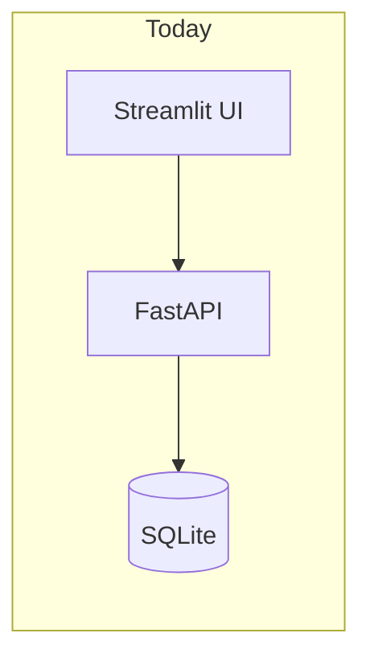
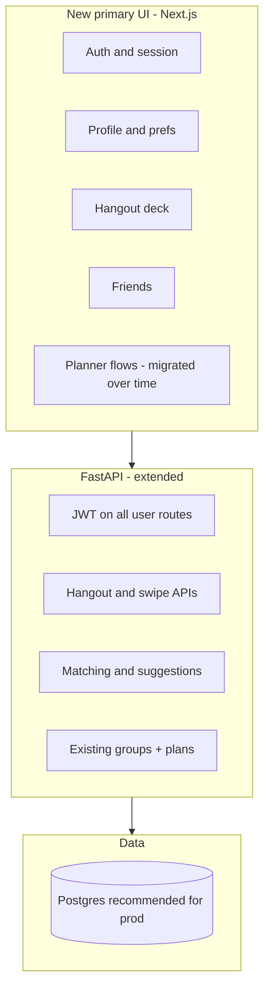

# Ship-ready Rowboat: profiles, friends, hangout swiping, and matching

**Overview:** Harden Rowboat for production (auth, data model), add hangout-based discovery with swipe + similarity matching, then introduce a Next.js (or React) web app as the primary UI—with a hybrid post-match flow that suggests a group and one-tap entry into the existing planner.

**User decisions captured in the plan:**

- **Post-match:** Hybrid — suggest a group + one-tap “Plan this outing” that creates the group and opens the planner.
- **UI direction:** Move toward a single modern web app (e.g. React/Next) for the whole product over time.

---

## Implementation checklist

- [ ] **authz-api** — Require JWT on friends/preferences (and related) routes; align path or `/me` pattern; update Streamlit callers.
- [ ] **prod-config-db** — Harden env validation; add Postgres + migrations path when moving off single SQLite.
- [ ] **profile-availability** — Extend profile model + structured availability fields for matching.
- [ ] **hangout-swipe-data** — Add hangout + swipe tables, APIs, feed generation hooking plans/agents.
- [ ] **matching-hybrid** — Implement similarity + cohort rules; suggested group + from-match group creation endpoint.
- [ ] **nextjs-shell** — Scaffold Next.js app: auth, profile, friends, swipe deck, Plan this outing flow.
- [ ] **planner-migration** — Incrementally port Streamlit planner steps to Next using existing FastAPI contracts.
- [ ] **tests** — Add tests for authz, swipe/match, and scorer.

---

## Current state (what you already have)

- **Backend:** FastAPI in `src/main.py`, SQLite via async SQLAlchemy in `src/db/tables.py`, deploy hints in `railway.toml`.
- **Auth:** JWT + email/password + Google OAuth in `src/api/auth.py` (`get_current_user`, `get_current_user_optional`).
- **Social:** Friends API in `src/api/friends.py` (request/respond/list); **no authorization**—routes take `user_id` in the path and do not verify it matches the bearer token. Same pattern on `src/api/preferences.py`.
- **Preferences / “profile” data:** `UserPreferences` in `src/models/user.py` (cuisines, activities, budget, dietary, neighborhoods, group size, etc.) persisted on `UserTable.preferences`.
- **Outings:** Groups + events in `src/db/tables.py`; AI planning in `src/api/plans.py` and agents under `src/agents/`.
- **UI:** Large Streamlit stepper in `src/ui/app.py`—good for the planner wizard, **poor fit** for a Bumble-like swipe experience and for a “single product” feel long term.

---

## Target architecture (phased)

---

## Phase 1 — Ship-ready backend foundations

**1.1 Authorize by identity, not URL alone**

- Change friends, preferences, and any other `/{user_id}/...` routes to require `Depends(get_current_user)` and assert `current_user.id == user_id` (or drop `user_id` from the path and use “me” routes: `/api/friends/me/...`).
- Update Streamlit (until replaced) to use the same pattern so the UI stops sending arbitrary IDs.

**1.2 Configuration and ops**

- Ensure `JWT_SECRET`, database URL, and API base URLs are required in production (fail fast if missing).
- **Database:** SQLite is fine for a single-node demo; for Railway or any multi-worker setup, plan **PostgreSQL** (SQLAlchemy URL swap + migrations). Document one migration path (e.g. Alembic).

**1.3 API consistency**

- Align README/docs with actual routes in `src/api/friends.py` (paths are under `/api/friends/...` with `user_id` segments today).

---

## Phase 2 — Richer profiles and availability for matching

**2.1 Profile surface**

- Extend the public/social profile beyond `User` + `UserPreferences` in `src/models/user.py`: e.g. optional **bio**, **avatar URL**, **display name** vs legal name, **interest tags** (can mirror or subset activity/cuisine lists).
- Persist either new columns on `UserTable` or a dedicated `user_profiles` JSON column—keep one clear source of truth for “matching vector” inputs.

**2.2 Availability for matching**

- Today, calendar data is OAuth-centric (`src/api/calendar.py`). For matching, add **structured availability** users can edit without calendar: e.g. weekly windows + timezone, or “usually free weekends”—used in scoring alongside Google busy times when connected.

**2.3 Similarity scoring (server-side)**

- Implement a small **pure-Python scorer** first: overlap on tags/cuisines/activities, budget compatibility, neighborhood overlap, group-size fit, soft penalty for conflicting dealbreakers.
- Optional later: embeddings for bios/tags if you outgrow rule-based scoring.

---

## Phase 3 — Hangouts + swipe (product core)

**3.1 Concepts**

- **Hangout card:** A discoverable proposal—not necessarily tied to an existing group yet: title, description, optional time window, location area, tags, source (`ai_suggested` | `user_created` | `template`).
- **Swipe:** `user_id` + `hangout_id` + `pass | interested` (+ timestamp). Idempotent updates allowed.
- **Match / cohort:** Define rules, e.g. users who **interested** the same hangout within a time window, or pairwise similarity above threshold **and** shared interest on ≥1 hangout.

**3.2 APIs**

- CRUD or list endpoints for hangout cards (feed generation can combine: trending, near user prefs, random exploration).
- `POST` swipe; `GET` suggested matches / “groups you could form.”
- **Hybrid flow:** when a cohort qualifies, create a **suggested group** record (or match record) with CTA payload: `{ group_id?, hangout_id, member_user_ids }` and **one endpoint** `POST /api/groups/from-match` (or similar) that creates a `GroupTable` row, adds members, and returns `group_id` so the **Next.js app** can deep-link into the planner with that `group_id`.

**3.3 Feed generation**

- MVP: generate hangout cards from existing search/recommendation pipeline (`src/api/plans.py`, agents) with stable IDs stored in DB.
- Later: user-submitted hangouts and moderation.

---

## Phase 4 — Next.js as the primary web app

**4.1 Scaffold**

- New app under e.g. `web/` (Next.js App Router, TypeScript): auth pages, layout, API client to FastAPI (`Authorization: Bearer`).

**4.2 Feature order**

1. Login/register (email + Google redirect to your existing OAuth callback, then store token client-side).
2. Profile + preferences (forms bound to secured profile/prefs APIs).
3. Friends (reuse secured friends API).
4. **Hangout swipe deck** (gestures + keyboard a11y); list of matches and **“Plan this outing”** → calls group-creation + navigates to planner route.
5. Migrate planner steps from Streamlit **incrementally** (hardest part—reuse the same REST contracts the Streamlit UI uses today from `src/ui/app.py`).

**4.3 Coexistence**

- Run Streamlit alongside Next during migration, or freeze Streamlit to “legacy” once parity exists for critical paths.
- Railway: two services or one process running API + Next static/SSR—your choice based on hosting budget.

---

## Testing and quality bar

- Unit tests for: JWT authorization on protected routes; swipe idempotency; match rule with fixed clocks; similarity scorer golden cases.
- Minimal E2E for auth + one swipe + suggested match API smoke test.

---

## Risks and mitigations

| Risk | Mitigation |
| ---- | ---------- |
| Rewriting all Streamlit at once | Next first for auth, profile, friends, swipe; planner last |
| SQLite locks under concurrent swipes | Postgres for production |
| Open CORS + no auth on user routes | Phase 1 authz before public launch |

---

## Summary

You already have auth, friends, and rich preference models; **ship-ready** means **locking APIs to the JWT user**, tightening config, and choosing Postgres when you leave single-process SQLite. **Hangout swiping** needs new tables and endpoints, plus **matching logic** and the **hybrid** “suggested group + one-tap plan” bridge into existing `src/api/groups.py` / planner flows. **Next.js** becomes the main shell for profiles, friends, swipe, and eventually the full planner—implemented in slices so the backend stays the source of truth throughout.
